# Suitmedia Mobile Developer Intern 2023 - Flutter

Andyan Yogawardhana

## App Screenshots (Emulator)

### First Screen

- Initial State

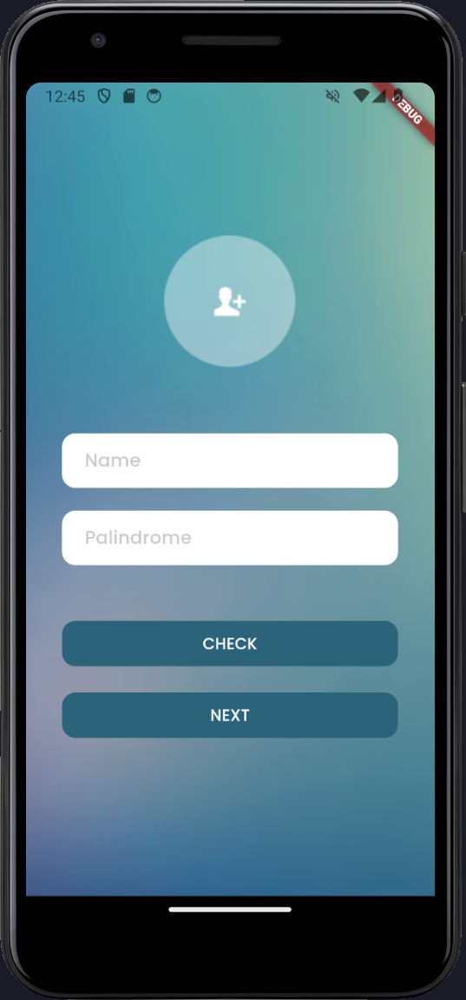

- Filled Text Fields

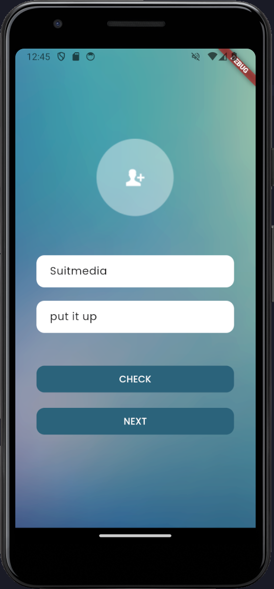

- Input Error

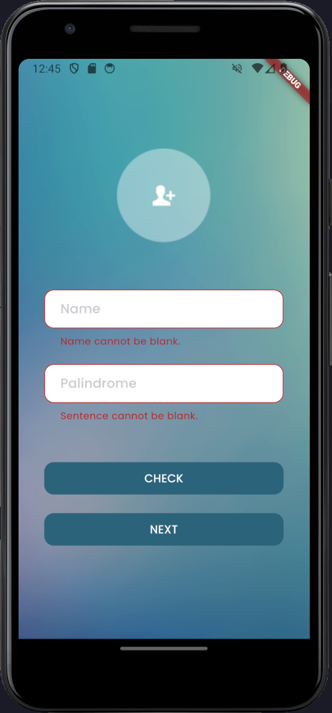

- Palindrome Check

  - is palindrome

    

  - not palindrome

    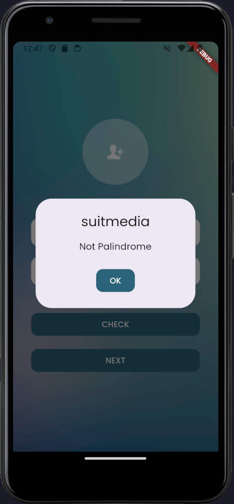

### Second Screen

- Initial State

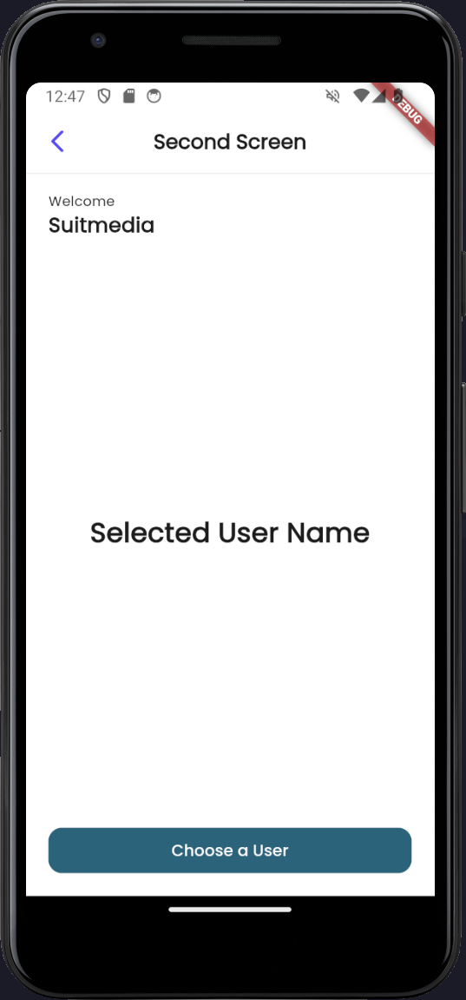

- Selected User Name

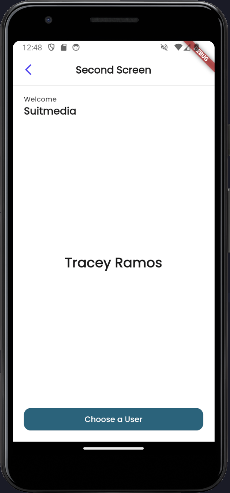

### Third Screen

- Initial User List from [regres.in](https://reqres.in/api/users?page=1&per_page=10n)

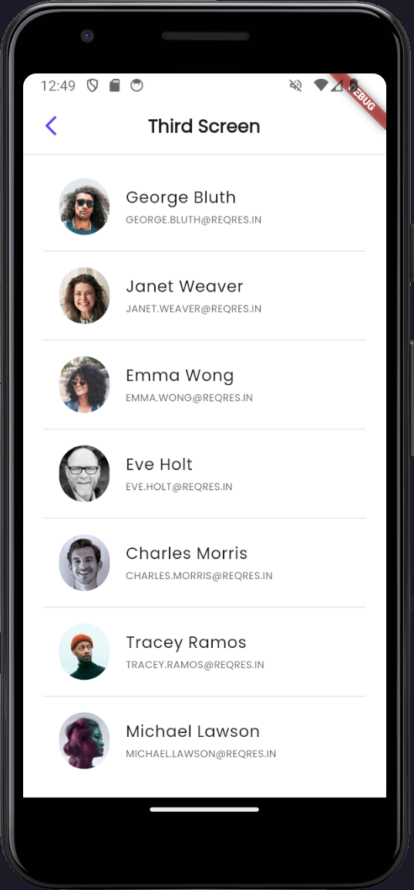

- Error State

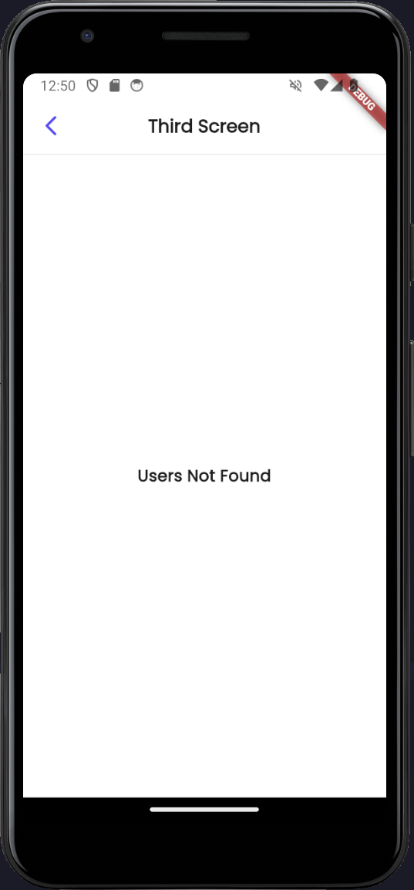

## App Screenshots (Real Device)

### First Screen

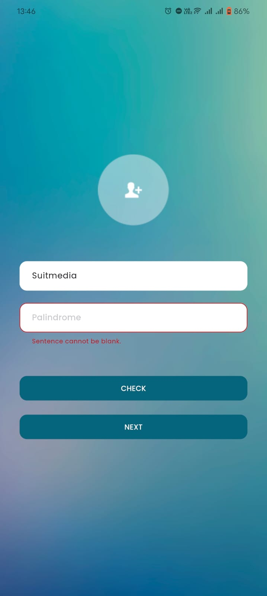
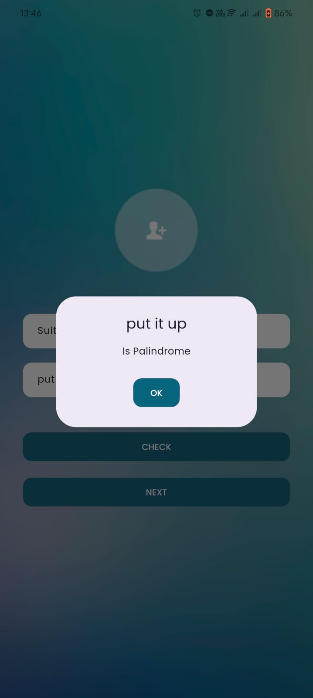

### Second Screen

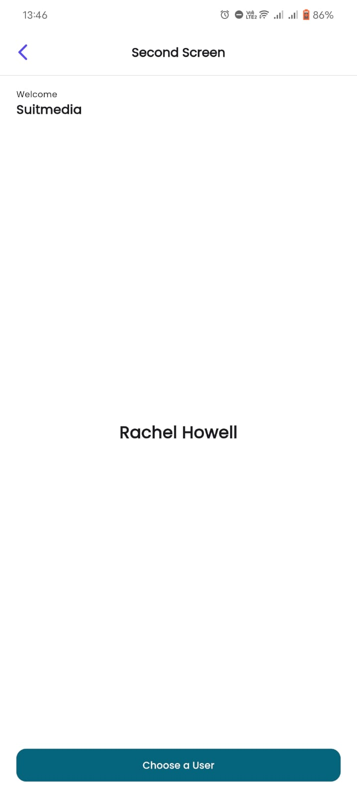

### Third Screen

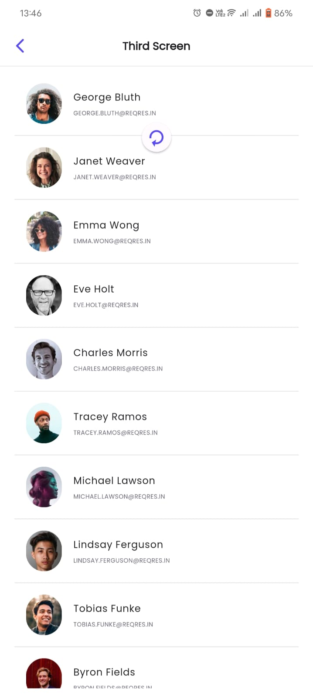

## App Demo (Emulator)

https://github.com/zenxiety/suitmedia-flutter/assets/65155073/bfe4ae44-ec3a-42d2-ae72-24ebf79449e8
